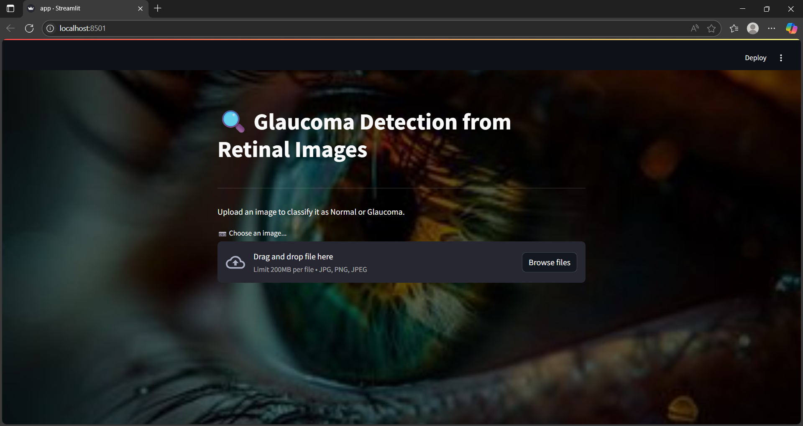

# Glaucoma Detection using Deep Learning

Early diagnosis of glaucoma is crucial to prevent vision loss. This project uses a ResNet50 convolutional neural network to classify fundus images as **Normal** or **Glaucoma-affected**.

## Tech stack

- Python
- TensorFlow and Keras
- ResNet50
- OpenCV (CLAHE and image augmentation)
- Streamlit

## Dataset

Fundus images from three combined sources (ACRIMA, DRISHTI-GS, ORIGA):

- [Glaucoma Classification Datasets on Kaggle](https://www.kaggle.com/datasets/ayush02102001/glaucoma-classification-datasets)

Place the data under `datasets/mixed_3_datasets/` with `Training` and `Testing` folders so the notebook paths resolve locally.

## Training results

- Training accuracy: 98.86%
- Validation accuracy: 88.89%
- Test accuracy: 77.64%

## How to run

```sh
pip install -r requirements.txt
python -m streamlit run app.py
```

The Streamlit app expects a trained weights file named `resnet50_50_epoch.h5` in the project root. That file is not committed (it is ignored as `*.h5`). Copy your trained model there before running inference.

## Streamlit UI

Upload a fundus image, preview it, and get a glaucoma vs normal prediction with a confidence score.



## License

This project is licensed under the MIT License. See [LICENSE](LICENSE).
